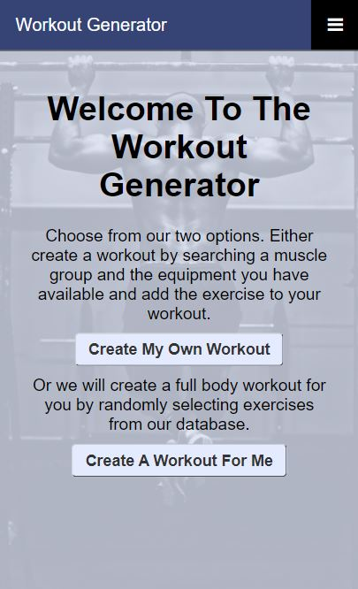
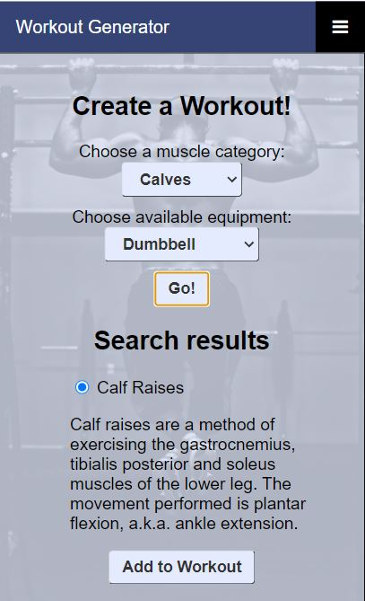
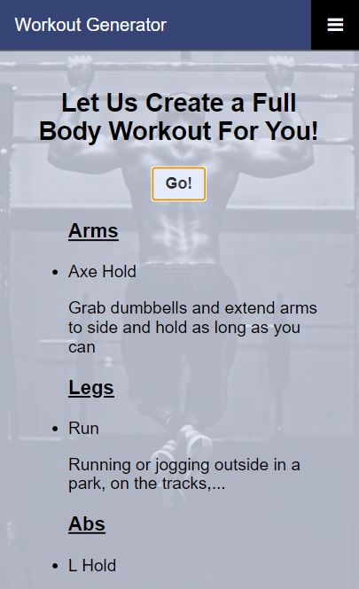

# Workout Generator

Checkout the app here: https://wesglassmeyer.github.io/workout-generator/index.html

# App Summary
We all know that we should be getting regular exercise. We also know that there are many benefits to having a varied routine to your exercise program. The hard part can be just having new ideas for what exercises to do when you go the the gym. The Workout Generator can help! This app will help you create a workout of your own by searching by muscle group and the equipment you have available. The app will also create a full body workout for you by randomly selecting an exercise from each muscle group. Then all you have to do is hit the gym and get to work!   

# Technology Used
- HTML
- CSS
- Javascript
- jQuery
- [WGER's Exercise API](https://wger.de/en/software/api)

# Screenshots
Landing page

Create your own workout

Random workout

